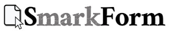
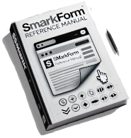
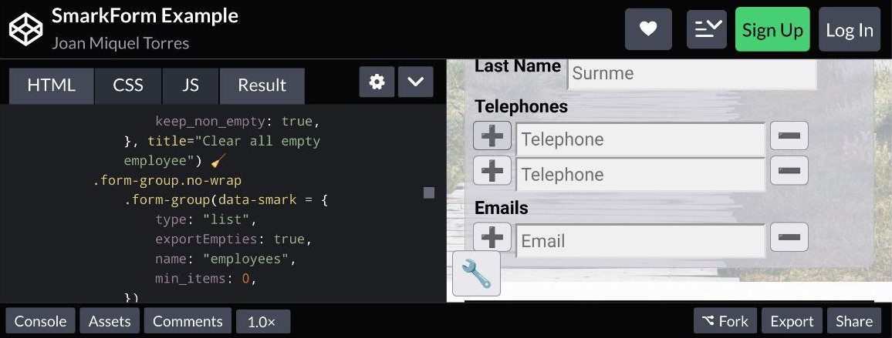

[](https://www.npmjs.com/package/smarkform)

<details>
<summary>Powerful while effortless Markup-driven and Extendable forms.</summary>

SmarkForm is a powerful library for creating markup-driven and extendable forms
in web applications.

SmarkForm empowers designers to enhance their form templates with
advanced capabilities, such as dynamic list manipulation and context-based
interactions, with no need to deal with complex JavaScript code.

</details>

[](https://www.npmjs.com/package/smarkform?activeTab=dependents)
[](https://opensource.org/licenses/MIT)

<a href="https://bitifet.github.io/SmarkForm/">

</a>

## Features

<details>
<summary>✔️  <b>Markup-driven and Intuitive API</b></summary>
<ul>
  <li>👉 Create powerful interactive forms with just plain htmL.</li>
  <li>👉 ...or (<a href="#summ_recommendations">advised</a>) use your preferred template engine.</li>
  <li>👉 Just add <code>data-smark</code> attribute to relevant tags and see the magic.</li>
  <li>👉 Intuitive option names.<ul>
    <li>
      <b>Ex.:</b>
      <code>&lt;button data-smark='{action: "addItem", for: "myList"&gt;</code>
    </li>
  </ul></li>
  <li>👉 Addressable elements by easy-to-read path-style relative or absolute addresses.</li>
  <li>👉 Complete separation between View and Controller logic.</li>
</ul>
</details>

<details>
<summary>✔️  <b>Easy to use and advanced capabilities</b></summary>
<ul>
  <li>👉 Leverage your existing HTML and CSS knowledge to create powerful forms.</li>
  <li>👉 No need for extensive JavaScript coding.</li>
  <li>👉 Add or remove items from lists with optional lower and upper limits.</li>
  <li>👉 Context-based actions (no need to hard-wire context and/or target).</li>
  <li>🚧 Dynamic and reactive options loading for dropdowns (comming soon).</li>
</ul>
</details>

<details>
<summary>✔️  <b>Flexible and extendable</b></summary>
<ul>
  <li>👉 Import and export complex forms in JSON format.</li>
  <li>👉 You can even import/export any subform instead of the whole one</li>
  <li>👉 Develop your own component types to suit your specific needs.</li>
</ul>
</details>

<details>
<summary>✔️  <b>Lightweight yet highly compatible</b></summary>
<ul>
  <li>👉 Bundled all three as ES Module, UMD and plain javascript file.</li>
  <li>👉 All of them less than 20KB each!</li>
  <li>👉 &gt; 0.25%, browser coverage through Babel</li>
</ul>
</details>


## Try it yourself!!

You can see **SmarkForm** in action in this complete CodePen example and even
fork and play with all SmarkForm features: 

[](https://codepen.io/bitifet/full/LYgvobZ)

> 👉 See also [SmarkForm Examples
> collection](https://codepen.io/collection/YyvbPz) from bare minimal to more
> complex examples in CodePen.


## Installation

To incorporate **SmarkForm** to your project you have several alternatives:

<details>
<summary>Using CDN <b>(Easiest approach)</b></summary>


### ES module

👉 Import it as ES module:

```html
<script type="module">
  import SmarkForm from 'https://cdn.jsdelivr.net/npm/smarkform/dist/SmarkForm.esm.js';
  
  // Use SmarkForm in your code
</script>
```


### Using UMD Module

👉 Include it your HTML file using a `<script>` tag:

```html
<script src="https://cdn.jsdelivr.net/npm/smarkform/dist/SmarkForm.umd.js"></script>
<script>
    // Now it is avalable as SmarkForm global variable.
</script>
```

👉 Import as CommonJS module:

```javascript
const SmarkForm = require("smarkform");
```

👉 Import as AMD (RequireJS) module:

```javascript
require(['https://cdn.jsdelivr.net/npm/smarkform/dist/SmarkForm.umd.js'], function(SmarkForm) {
  // Now it is avalable as SmarkForm local variable.
});
```


> 📌 These examples will use the latest published version of SmarkForm from
> NPM. If you prefer to use a specific version, you can specify the version
> number in the CDN URLs. For example, if you want to use version 0.1.0, the
> CDN URLs would be:
>
> - **ESM:** `https://cdn.jsdelivr.net/npm/smarkform@0.1.0/dist/SmarkForm.esm.js`
> - **UMD:** `https://cdn.jsdelivr.net/npm/smarkform@0.1.0/dist/SmarkForm.umd.js`
>
> Make sure to replace `0.1.0` with the desired version number in the URLs.


</details>


<details>
<summary>Installing it from NPM</summary>


👉 Execute:

```sh
npm install smarkform
```

👉  Then you can use it with your favourite bundler or pick it in your preferred
format:

```
node_modules
└── smarkform
    └── dist
        ├── SmarkForm.esm.js
        └── SmarkForm.umd.js
```

> 📌 *SmarkForm.umd.js* can be loaded from regular ``<script>`` tag and will export
> ``SmarkForm`` class as global variable.

</details>


<details>
<summary>Clone from GitHub</summary>

👉 Execute:

```sh
git clone git@github.com:bitifet/SmarkForm.git
```

👉 Then, like with NPM package, you will find it under *dist* directory:

```
dist
├── SmarkForm.esm.js
└── SmarkForm.umd.js
```

👍 ...but you can also install dev dependencies by running ``npm install`` and then


    "build": "rollup -c",
    "dev": "rollup -c -w",
    "test": "mocha",
    "pretest": "npm run build",
    "start": "node ./playground/bin/www.js"


- ``npm run build``: To build after doing some change.
- ``npm run dev``: To build and watch for any source file change and auto rebuild as needed.
- ``npm run test``: To run automated tests.
- ``npm start``: To run Express server with the playground environment.

</details>


## Usage

> 📌 For detailed usage instructions and API reference check out [📔 SmarkForm
> Reference Manual](https://bitifet.github.io/SmarkForm/).


<details>
<summary>Start with a simple example...</summary>

1. Write some HTML code such as this in your document:
    ```html
    <div id="myForm">
    <p>
        <b>Activity:</b>
        <input data-smark name="activity" placeholder="Activity Description">
    </p>
    <p>
        <button data-smark='{"action":"addItem","for":"participants"}'>+</button>
        <span>Participants:</span>
    </p>
    <ul data-smark='{"type":"list","name":"participants"}'>
        <li>
        <input data-smark name="name" placeholder="Name">
        <input data-smark name="phone" type="tel" placeholder="Phone number">
        <button data-smark='{"action":"removeItem"}'>-</button>
        </li>
    </ul>
    <p>
        <button data-smark="{"action":"empty"}">❌ Clear</button>
        <button data-smark="{"action":"export"}">💾 Submit</button>
    </p>
    </div>
    ```

2. Import *SmarkForm* the way you want.
    For example as ES Module.
    ```javascript
    import SmarkForm from 'https://cdn.jsdelivr.net/npm/smarkform/dist/SmarkForm.esm.js';
    ```
    > 📌 See [Installation Section](#installation) for more options.


3. Then add a few JavaScript code to enhance it as SmarkForm:
    ```javascript
    import SmarkForm from 'https://cdn.jsdelivr.net/npm/smarkform/dist/SmarkForm.esm.js';
     
    const form = new SmarkForm(
         document.getElementById("myForm")
         // , {
         //       ...options
         // }
    );
 
    console.log(form);
        // Now you can capture form object from browser console and play with
        // .export() and .import() methods...
    ```

3. Fine tune action's behaviour:

    ```javascript
    /* ... */
    const form = new SmarkForm(
        document.querySelector("#myForm")
        , {
            onAfterAction_export({data}) {
                // Do something with exported data:
                console.log(data);
            },
            async onBeforeAction_empty({context, preventDefault}) {
                // Ask for confirmation unless form is already empty:
                if (
                    ! await context.isEmpty()
                    && ! confirm("Are you sure?")
                ) preventDefault();
            },
        }
    );
    ```

</details>

<details>
<summary>Extend it with all SmarkForm power</summary>

Bla bla bla...

</details>

<details>
<summary id="summ_recommendations">Recommendations</summary>

  * Using some template engine such as [PugJS](https://pugjs.org) to generate
    html is advised to avoid eventual chararacter interpolation issues.
    Specially with *data-smark* attribute JSON data.
    - Previous html snippet would look like as follows with as Pug template:
    ```javascript
    #myForm
        p
            b Activity:
            input(data-smark name="activity" placeholder="Activity Description")
        p
            button(data-smark={
                action: "addItem",
                for: "participants",
            }) +
            span Participants:
        ul(data-smark={
            name: "participants",
        })
            li
                input(data-smark name="name" placeholder="Name")
                input(data-smark name = "phone" type="tel" placeholder="Phone number")
                button(data-smark={
                    action: "removeItem"
                }) -
    ```

</details>

<details>
<summary>✅ See Also</summary>

  * [📔 SmarkForm Refernce Manual](https://bitifet.github.io/SmarkForm/)

  * [💾 SmarkForm Examples collection in CodePen](https://codepen.io/collection/YyvbPz)

</details>


## RoadMap

<details>
<summary> <b>Implementation.</b></summary>

<details>
<summary> Core functionality.</summary>

*SmarkForm* Core functionality is in mature state.

Almost all initially planed features are implemented and working well.

The only exception is the "API interface" which will allow future *select*
component type to fetch its optinons dynamically depending on the value of
other fields (See *Select Component* in [Core component
types](#core-component-types) section).

</details>

<details>
<summary> Core component types and actions.</summary>


<details>
<summary> Form Component Type </summary>

Implementation complete.

</details>

<details>
<summary> List Component Type </summary>

Implementation complete.

</details>

<details>
<summary> Singleton Component Type </summary>

Implementation complete.

</details>

<details>
<summary> Input Component Type </summary>

Implementation complete.

</details>

<details>
<summary> Select Component Type.</summary>

Select component will be capable of loading its options from a remote API call
by passing its *src* property to so called "API Interface".

The *API Interface* will allow *select* (and other future components) to fetch
their options dynamically from an external API and react to any change in any
other fields whose value were used as argument to the API call.

For detailed explanation see: [Select Component Type](type_select.md).

</details>

<details>
<summary> Number Component Type </summary>

Not yet implemented (but comming soon).

It will just wrap input component to export as number instead of string (we
will use a separate component to respect original ``<input>`` tag behaviour
which returns text even if its *type* attribute is "number".

</details>

<details>
<summary> Date Component Type </summary>

Not yet implemented (but comming soon).

</details>

<details>
<summary> Action (Special) Component Type </summary>

Fully functional but only for regular clicks.

Special behaviours for right / middle / (other) cliks, keyboard events, etc...
may be eventually implemented in the future. But not a priority yet.

</details>


</details>

</details>

<details>
<summary> <b>Automated tests.</b></summary>

A mature testing structure with mocha and puppetter is set up to easily
implement tests over any SmarkForm feature.

But only a few actual tests are implemented yet. More tests need to be
developed to ensure all functionality keeps working while implementation
advances.

</details>

<details>
<summary> <b>Documentation.</b></summary>

Introductory README file is quite mature. But usage and API documentation still
needs a lot of work...

</details>


> 📌 ...And many more amazing ideas in the [TODO list](./TODO.md).


## Contributing

Contributions are welcome! If you find any issues or have suggestions for improvements, please open an issue or submit a pull request.

Before contributing, make sure to read our [contribution guidelines](docs/contributing.md).


## License

  [MIT](LICENSE)


# Acknowledgements

We would like to express our gratitude to the open source community for their valuable contributions and feedback.


