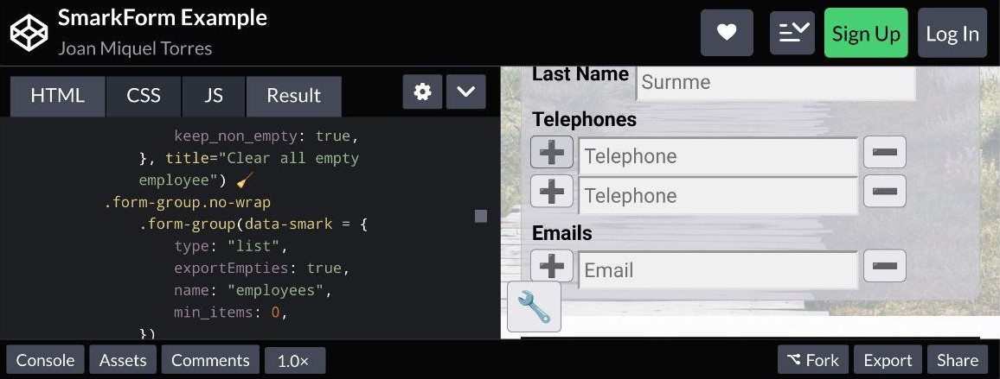

[](https://www.npmjs.com/package/smarkform)

<details>
<summary>Powerful while effortless Markup-driven and Extendable forms.</summary>

SmarkForm is a powerful library for creating markup-driven and extendable forms
in web applications. It empowers designers to enhance their form templates with
advanced capabilities, such as dynamic list manipulation and context-based
interactions, without the need for complex JavaScript code.

</details>

[](https://www.gnu.org/licenses/gpl-3.0.html)

## Features

- **Markup-driven**: Create powerful interactive forms with plain HTML (or your preferred template engine) by just adding the `data-smark` attribute to relevant tags.
- **Advanced capabilities**: Add or remove items from lists, dynamic (and reactive) options loading for dropdowns, and perform context-based actions easily.
- **Easy to use**: Leverage your existing HTML and CSS knowledge to create powerful forms without the need for extensive JavaScript coding.
- **Flexible and extendable**: Import and exports complex forms in JSON format, and develop your own component types to suit your specific needs.
- **Intuitive API**: Access every component in the form tree with simple path-style addresses or utilize built-in methods for seamless form manipulation.
- **MVC Enabled**: Complete separation between View and Controller logic.

## Try it yourself!!

You can see **SmarkForm** in action in this complete CodePen example and even
fork and play with all SmarkForm features: 

[](https://codepen.io/bitifet/full/LYgvobZ)

## Installation

To incorporate **SmarkForm** to your project you have several alternatives:

<details>
<summary>Directly import from SkyPack CDN **(Easiest approach)**</summary>


👉 As ES module:

```javascript
import SmarkForm from "https://cdn.skypack.dev/smarkform";
```

</details>


<details>
<summary>Installing it from NPM</summary>


👉 Execute:

```sh
npm install smarkform
```

👉  Then you can use it with your favourite bundler or pick it in your preferred
format:

```
node_modules
└── smarkform
    └── dist
        ├── SmarkForm.esm.js
        ├── SmarkForm.umd.js
        └── SmarkForm.js
```

> 📌 *SmarkForm.js* can be loaded from regular ``<script>`` tag and will export
> ``SmarkForm`` class as global variable.

</details>


<details>
<summary>Clone from GitHub</summary>

👉 Execute:

```sh
git clone git@github.com:bitifet/SmarkForm.git
```

👉 Then, like with NPM package, you will find it under *dist* directory:

```
dist
├── SmarkForm.esm.js
├── SmarkForm.umd.js
└── SmarkForm.js
```

👍 ...but you can also install dev dependencies by running ``npm install`` and then


    "build": "rollup -c",
    "dev": "rollup -c -w",
    "test": "mocha",
    "pretest": "npm run build",
    "start": "node ./playground/bin/www.js"


- ``npm run build``: To build after doing some change.
- ``npm run dev``: To build and watch for any source file change and auto rebuild as needed.
- ``npm run test``: To run automated tests.
- ``npm start``: To run Express server with the playground environment.

</details>


## Usage

> 📌 For detailed usage instructions and API reference check out [SmarkForm
> Manual](doc/index.md).


<details>
<summary>Start with a simple example...</summary>

1. Write some HTML code such as this in your document:
   ```html
    <div id="myForm">
    <p>
        <b>Activity:</b>
        <input data-smark name="activity" placeholder="Activity Description">
    </p>
    <p>
        <button data-smark='{"action":"addItem","for":"participants"}'>+</button>
        <span>Participants:</span>
    </p>
    <ul data-smark='{"type":"list","name":"participants"}'>
        <li>
        <input data-smark name="name" placeholder="Name">
        <input data-smark name="phone" type="tel" placeholder="Phone number">
        <button data-smark='{"action":"removeItem"}'>-</button>
        </li>
    </ul>
    </div>
   ```

2. Add a few JavaScript code to enhance it as SmarkForm:
   ```javascript
   import SmarkForm from "https://cdn.skypack.dev/smarkform";
    
    const form = new SmarkForm(
        document.getElementById("myForm")
    );

    console.log(form);
        // Now you can capture form object from browser console and play with
        // .export() and .import() methods...
    ```

</details>

<details>
<summary>Extend it with all SmarkForm power</summary>

Bla bla bla...

</details>

<details>
<summary>Recommendations</summary>

  * Using some template engine such as [PugJS](https://pugjs.org) to generate
    html is advised to avoid eventual chararacter interpolation issues.
    - Previous html snippet would look like as follows with as Pug template:
    ```javascript
    #myForm
        p
            b Activity:
            input(data-smark name="activity" placeholder="Activity Description")
        p
            button(data-smark={
                action: "addItem",
                for: "participants",
            }) +
            span Participants:
        ul(data-smark={
            type: "list",
            name: "participants",
        })
            li
                input(data-smark name="name" placeholder="Name")
                input(data-smark name = "phone" type="tel" placeholder="Phone number")
                button(data-smark={
                    action: "removeItem"
                }) -
    ```

</details>

<details>
<summary>See Also</summary>

  * [💾 Code Snippets and Samples](doc/index.md#-code-snippets-and-samples)

</details>

## Contributing

Contributions are welcome! If you find any issues or have suggestions for improvements, please open an issue or submit a pull request.

Before contributing, make sure to read our [contribution guidelines](doc/contributing.md).


## License

SmartKup is licensed under the [GPL-v3 License](https://www.gnu.org/licenses/gpl-3.0.html).


# Acknowledgements

We would like to express our gratitude to the open source community for their valuable contributions and feedback.


