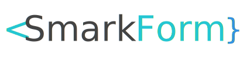
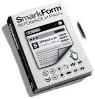

[](https://smarkform.bitifet.net)

🚀 **Powerful while effortless Markup-driven and Extendable form controller.**

[![NPM Version][npm-image]][npm-url]
[![npm dependencies][dependencies-image]][dependencies-url]
[![NPM Downloads][downloads-image]][downloads-url]
[![jsDelivr Hits][cdnhits-image]][cdnhits-url]
[![License][license-image]][license-url]
<!-- Highlighting fix: []() -->

*SmarkForm* is a lightweight library designed for front-end developers and
designers to enhance HTML forms with powerful features like **subforms** and
dynamic, variable-length **lists**, context driven **hotkeys** and more...

🔧 It seamlessly integrates with the DOM to provide a markup-agnostic solution,
freeing your form layout from rigid structure and styling constraints while
enabling **JSON form data import and export** and ensuring compatibility with
modern workflows.

♿ With a focus on accessibility (a11y), SmarkForm offers configurable hotkeys,
**smooth navigation**, and a **low-code experience**, making it an extendable
and versatile tool for building HTML form applications.

\[[More...](https://smarkform.bitifet.net/about/introduction)\]


## 30-second Example

A contact form with a dynamic phone-number list — no manual wiring, just markup:

```html
<!-- HTML -->
<div id="myForm">
  <p><input name="name" data-smark placeholder="Name"></p>
  <ul data-smark='{"name":"phones","of":"input"}'>
    <li><input type="tel" data-smark placeholder="Phone"></li>
  </ul>
  <button data-smark='{"action":"addItem","context":"phones"}'>➕ Add phone</button>
  <button data-smark='{"action":"removeItem","context":"phones"}'>➖ Remove</button>
  <button data-smark='{"action":"export"}'>💾 Export JSON</button>
</div>
```

```javascript
// JS — one line to initialize
const myForm = new SmarkForm(document.getElementById("myForm"));

// Listen for the exported data
myForm.on("AfterAction_export", ({ data }) => console.log(data));
// → { name: "Alice", phones: ["555-1234", "555-5678"] }
```

That's it. No schema, no bindings, no callbacks per field.


## What SmarkForm Is (and Isn't Yet)

**SmarkForm is:**
- ✅ A **markup-driven** form controller: configuration lives in `data-smark`
  attributes, not JavaScript objects.
- ✅ **Markup-agnostic**: it imposes no HTML structure or CSS — you keep full
  design freedom.
- ✅ A tool for **JSON-based import/export** of complex, nested form data.
- ✅ Ready for **subforms**, **variable-length lists**, **context-driven hotkeys**,
  and smooth keyboard navigation.
- ✅ Stable and in active use, but still pre-1.0 (API may evolve).

**Not yet implemented (planned for a future release):**
- ❌ Built-in validation (field-level error messages).
- ❌ Native `<form>` tag POST submission — use `AfterAction_export` + `fetch` instead.
- ❌ The "API interface" for dynamic dropdown/select options from a server.

> ⚠️ SmarkForm is currently at **version 0.x**. The public API is stable for
> the implemented features, but breaking changes may still occur before 1.0.


## TL;DR


Want to dig deeper right away? Head to the [🔗 Showcase](https://smarkform.bitifet.net/about/showcase)
to explore interactive demos — including the example above — that show
SmarkForm's full potential at a glance.

Prefer to jump straight into code? Browse [🔗 Live Examples](https://smarkform.bitifet.net/resources/examples)
for a collection of ready-to-use, downloadable forms you can run locally and
start tinkering with immediately.


## Main Features

  * `<>` [Markup agnostic](https://smarkform.bitifet.net/about/features#markup-agnostic):
    Maximum decoupling between design and development teams.
  * `🧩` [Low code](https://smarkform.bitifet.net/about/features#easy-to-use-low-code):
    Markup driven. No manual wiring between controls and fields.
  * `🗂` [Subforms](https://smarkform.bitifet.net/about/features#nestable-forms):
    Nested forms to any depth.
  * `📑` [Lists](https://smarkform.bitifet.net/about/features#variable-length-lists):
    Sortable and variable-length lists (arrays) either of scalars or subforms.
  * `🫳` [Configurable hot keys](https://smarkform.bitifet.net/about/features#context-driven-hotkeys):
    Context-driven and discoverable keyboard shortcuts.
  * `🫶` [Consistent UX](https://smarkform.bitifet.net/about/features#consistent-user-experience):
    Smooth navigation and consistent behaviour across all forms.
  * `{}` [JSON format](https://smarkform.bitifet.net/about/features#json-based):
    Data is imported / exported as JSON.
  * `🪶` [Lightweight](https://smarkform.bitifet.net/about/features#lightweight-yet-highly-compatible):
    Only ~38KB minified.
  * `♿` [Accessibility](https://smarkform.bitifet.net/about/features#a11y-friendly):
    Focus on UX and accessibility (a11y).
  * `🆓` [Dependency-free](https://www.npmjs.com/package/smarkform?activeTab=dependencies):
    No external dependencies required.
  * `💪` Flexible, extendable and
    [more...](https://smarkform.bitifet.net/about/features ).


## Usage and Documentation

For detailed usage instructions and API reference check out [📔 SmarkForm
Reference Manual](https://smarkform.bitifet.net).

<a href="https://smarkform.bitifet.net">

</a>

  * Check our [Showcase](https://smarkform.bitifet.net/about/showcase) for a 
    quick overview of what SmarkForm can do.

  * The [Quick Start
    Guide](https://smarkform.bitifet.net/getting_started/quick_start) provides
    a fast introduction to get you up and running quickly.

  * Don't miss our [Live
    Examples](https://smarkform.bitifet.net/resources/examples). You can
    download each one and modify as you like.

  * *SmarkForm* is available as ESM and UMD modules via NPM or GitHub or via
    CDN. See [Getting
    SmarkForm](https://smarkform.bitifet.net/getting_started/getting_smarkform)
    for more details.


## Troubleshooting and FAQ

For troubleshooting tips and frequently asked questions, please visit
SmarkForm's [Frequently Asked Questions
(FAQ)](https://smarkform.bitifet.net/about/faq)


## Community and Support

If you don't find a solution there, feel free to open a [discussion on our
GitHub repository](https://github.com/bitifet/SmarkForm/discussions).

For further support, you can contact me through our [Contact
Page](https://smarkform.bitifet.net/community/contact) or reach out via email at [smarkform@bitifet.net](mailto:smarkform@bitifet.net).


### 🚀 Stay tuned

<div style="display: flex; flex-wrap: wrap; justify-content: center; gap: 1rem; padding: 1rem;">
  <div style="flex: 1; max-width: 20vw; min-width: 250px; text-align: center;">
    <b>News and announcements:</b>
    <a href="https://t.me/smarkform" rel="noopener noreferrer">
    
    </a>
  </div>
  <div style="flex: 1; max-width: 20vw; min-width: 250px; text-align: center;">
    <b>Community Chat:</b>
    <a href="https://t.me/SmarkFormCommunity" rel="noopener noreferrer">
    
    </a>
  </div>
</div>


## Contributing

Contributions are welcome! If you find any issues or have suggestions for improvements, please open an issue or submit a pull request.

Before contributing, make sure to read our [contribution guidelines](CONTRIBUTING.md).

Please note that this project is released with a [Contributor Code of Conduct](CODE_OF_CONDUCT.md). By participating in this project you agree to abide by its terms.


## License

  [MIT](LICENSE)


## Keywords

front-end – form – form-controller – form-library – json-form – lightweight –
vanilla – css-agnostic – DOM – html-form – no-dependencies – a11y


[npm-image]: https://img.shields.io/npm/v/smarkform.svg
[npm-url]: https://npmjs.org/package/smarkform
[dependencies-image]: https://img.shields.io/badge/dependencies-0-green
[dependencies-url]: https://www.npmjs.com/package/smarkform?activeTab=dependencies
[downloads-image]: https://img.shields.io/npm/dm/smarkform.svg
[downloads-url]: https://npmjs.org/package/smarkform
[cdnhits-image]: https://data.jsdelivr.com/v1/package/npm/smarkform/badge?style=rounded
[cdnhits-url]: https://www.jsdelivr.com/package/npm/smarkform
[license-image]: https://img.shields.io/badge/license-MIT-brightgreen.svg
[license-url]: https://opensource.org/licenses/MIT

