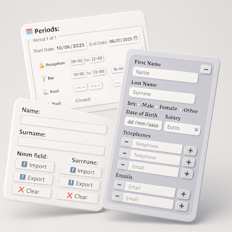



# SmarkForm

<a
    href='{{ "resources/examples" | relative_url }}'
    title="Click to see Live Examples..."
>
 
🔗 Live Examples
</a>

## Powerful while effortless Markup-driven and Extendable forms.

[![NPM Version][npm-image]][npm-url]
[![npm dependents][depends-image]][depends-url]
[![NPM Downloads][downloads-image]][downloads-url]
[![License][license-image]][license-url]
<!-- Hilighting fix:  -->

**SmarkForm** is a powerful library for creating markup-driven and extendable
forms in web applications.

SmarkForm empowers designers to enhance their form templates with advanced
capabilities, such as dynamic list manipulation and context-based interactions,
with no need to deal with complex JavaScript code. \[[More...]({{
    "about/about_smarkform" | relative_url }})\]

## Features

  * **Responsive and accessible UX** across devices.
  * **Imports/Exports JSON** supporting nested subforms (objects) and
    variable-length lists (arrays).
  * Configurable context-driven keyboard shortcuts (hotkeys)
  * Easy to use **Markup-driven** and Intuitive API.
  * No reliance on a specific HTML structure: **Designers have complete freedom**.
  * **No manual wiring** between controls and fields.
  * Lightweigh (**Only {{ site.data.computed.bundleSizeKB }}KB** minified), flexible and extendable.
  * [More...](https://smarkform.bitifet.net/about/features)

## Sample Code:

The following code snippet shows *SmarkForm* simplicity.

👉 You will find similar examples working preview along this documentation.
**Don't miss the `📝 Notes` tab** to be aware of the nitty-gritty details.



{: .hint}
> Also check out our
> [🔗 Complete Examples]({{ "resources/examples" | relative_url }})
> to see what SmarkForm is capable of in a glance!!

## Current Status

SmarkForm implementation is stable and fully functional, but not all initially
planned requirements are yet implemented. Hence, it's not yet in the 1.0.0
version. \[[🔗 More...]({{ "about/about_smarkform" | relative_url }}#status)\]

**Last Updated:** {{ site.data.computed.lastUpdated }}.

## Where to Go Next?

To get started with SmarkForm you can:

| 👉 Follow our [🔗 Quick Start Guide]({{ "getting_started/quick_start" | relative_url }}) to rapidly dive in. |
| 👉 Check out our [🔗 Downloadable Examples]({{ "resources/examples" | relative_url }}) to see them in action and/or start tinkering. |

## License

[🔗 MIT]({{ "community/license" | relative_url }})

## Contributing

We welcome any feedback, suggestions, or improvements as we continue to enhance
and expand the functionality of SmarkForm.

{: .info}
>   * See the [🔗 Contributing Section]({{ "community/contributing" | relative_url }})
>     for more details...

[npm-image]: https://img.shields.io/npm/v/smarkform.svg
[npm-url]: https://npmjs.org/package/smarkform
[depends-image]: https://badgen.net/npm/dependents/smarkform
[depends-url]: https://www.npmjs.com/package/smarkform?activeTab=dependents
[downloads-image]: https://img.shields.io/npm/dm/smarkform.svg
[downloads-url]: https://npmjs.org/package/smarkform
[license-image]: https://img.shields.io/badge/license-MIT-brightgreen.svg
[license-url]: https://opensource.org/licenses/MIT
