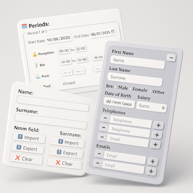



 <!-- event_planner_html {{{ --> 


  █

    █    

      █        <label data-smark>📋 Event:</label>
      █        <input data-smark name="title" type="text" placeholder="e.g. Sprint Review">
      █    

    █    

      █        <label data-smark>📅 Date:</label>
      █        <input data-smark name="date" type="date">
      █    

    █    

      █        <label data-smark>⏰ Time:</label>
      █        <input data-smark name="time" type="time">
      █    

    █    <fieldset data-smark='{"type":"form","name":"organizer"}'>
      █        <legend data-smark='label'>👤 Organizer</legend>
      █        

        █            <label data-smark>Name:</label>
        █            <input data-smark name="name" type="text">
        █        

      █        

        █            <label data-smark>Email:</label>
        █            <input data-smark name="email" type="email">
        █        

      █    </fieldset>
    █    

      █        <button data-smark='{"action":"removeItem","context":"attendees","hotkey":"Delete","preserve_non_empty":true}' title='Remove empty slots'>🧹</button>
      █        <button data-smark='{"action":"addItem","context":"attendees","hotkey":"+"}' title='Add attendee'>➕</button>
      █        <strong data-smark='label'>👥 Attendees:</strong>
      █        <ul data-smark='{"type":"list","name":"attendees","of":"input","sortable":true,"exportEmpties":false}'>
        █            <li>
          █                N.
          █                <input data-smark type="text" placeholder="Name">
          █                <button data-smark='{"action":"removeItem","hotkey":"-"}' title='Remove'>➖</button>
          █                <button data-smark='{"action":"addItem","hotkey":"+"}' title='Insert here'>➕</button>
          █            </li>
        █        </ul>
      █    

    █    
💡 Hold <kbd>Ctrl</kbd> to reveal shortcuts

    █


 <!-- }}} --> 

 <!-- event_planner_css {{{ --> 

{{""}}#myForm$$ .ep {
    display: flex;
    flex-direction: column;
    gap: 0.35em;
    max-width: 460px;
    font-size: 0.95em;
}
{{""}}#myForm$$ .ep p {
    display: flex;
    align-items: center;
    gap: 0.5em;
    margin: 0;
}
{{""}}#myForm$$ .ep label {
    min-width: 4.5em;
    font-weight: 500;
    white-space: nowrap;
}
{{""}}#myForm$$ .ep input {
    padding: 0.3em 0.5em;
    border: 1px solid #ccc !important;
    border-radius: 4px;
}
{{""}}#myForm$$ .ep input[type="text"],
{{""}}#myForm$$ .ep input[type="email"] {
    flex: 1;
}
{{""}}#myForm$$ .ep fieldset {
    border: 1px solid #ddd !important;
    border-radius: 6px;
    padding: 0.4em 0.8em 0.6em;
    margin: 0;
    display: flex;
    flex-direction: column;
    gap: 0.3em;
}
{{""}}#myForm$$ .ep fieldset legend {
    font-weight: bold;
    padding: 0 0.3em;
}
{{""}}#myForm$$ .ep-list ul {
    list-style: none !important;
    padding: 0 !important;
    margin: 0.2em 0 0;
    display: flex;
    flex-direction: column;
    gap: 0.25em;
}
{{""}}#myForm$$ .ep-list ul li {
    display: flex;
    align-items: center;
    gap: 0.4em;
}
{{""}}#myForm$$ .ep-hint {
    font-size: 0.82em;
    color: #888;
    margin: 0.15em 0 0;
}
{{""}}#myForm$$ .ep-hint kbd {
    background: #f4f4f4;
    border: 1px solid #ccc;
    border-radius: 3px;
    padding: 1px 4px;
}
/* Hotkey hints revealed on Ctrl press */
{{""}}#myForm$$ [data-hotkey] {
    position: relative;
    overflow-x: visible;
}
{{""}}#myForm$$ [data-hotkey]::before {
    content: attr(data-hotkey);
    display: inline-block;
    position: absolute;
    top: 2px;
    left: 2px;
    z-index: 10;
    pointer-events: none;
    background-color: #ffd;
    color: #44f;
    outline: 1px solid lightyellow;
    padding: 2px 8px;
    border-radius: 4px;
    font-weight: bold;
    font-family: sans-serif;
    font-size: 0.8em;
    white-space: nowrap;
    transform: scale(1.8) translate(0.1em, 0.1em);
}
/* Attendee list item entry/exit animations */
{{""}}#myForm$$ .ep-list ul li.animated_item {
    transform: translateX(-100%);
    opacity: 0;
    transition:
        transform 200ms ease-out,
        opacity 200ms ease-out;
}
{{""}}#myForm$$ .ep-list ul li.animated_item.ongoing {
    transform: translateX(0);
    opacity: 1;
    transition:
        transform 200ms ease-in,
        opacity 200ms ease-in;
}
 <!-- }}} --> 

 <!-- event_planner_js {{{ --> 
const delay = ms=>new Promise(resolve=>setTimeout(resolve, ms));
{{""}}myForm.onAll("afterRender", async function(ev) {
    if (ev.context.parent?.options.type !== "list") return;
    const item = ev.context.targetNode;
    item.classList.add("animated_item");
    await delay(1);
    item.classList.add("ongoing");
});
{{""}}myForm.onAll("beforeUnrender", async function(ev) {
    if (ev.context.parent?.options.type !== "list") return;
    const item = ev.context.targetNode;
    item.classList.remove("ongoing");
    await delay(150);
});

 <!-- }}} --> 

<h1>
  <picture>
    <source srcset="/assets/logo/smarkform_dark.svg" media="(prefers-color-scheme: dark)">
    
  </picture>
</h1>

🚀 **Powerful while effortless Markup-driven and Extendable form controller.**

[![NPM Version][npm-image]][npm-url]
[![npm dependencies][dependencies-image]][dependencies-url]
[![NPM Downloads][downloads-image]][downloads-url]
[![jsDelivr Hits][cdnhits-image]][cdnhits-url]
[![License][license-image]][license-url]

*SmarkForm* is a lightweight, markup-driven form controller for front-end
developers: add `data-smark` attributes to your HTML, initialize with one line
of JavaScript, and get powerful **subforms**, variable-length **lists**,
context-driven **hotkeys**, and JSON import/export — all without touching your
layout.

👉 See [What SmarkForm Is (and Isn't Yet)]({{ "about/introduction" | relative_url }}) for more details.

## Interactive Demo

A nested subform, a sortable list, context-driven hotkeys, and date/time
coercion — all driven by `data-smark` attributes with zero extra JavaScript.


{
    "title": "Sprint Review",
    "date": "2025-03-15",
    "time": "10:00:00",
    "organizer": {
        "name": "Alice Johnson",
        "email": "alice@example.com"
    },
    "attendees": [
        "Bob Smith",
        "Carol White",
        "Dave Brown"
    ]
}




## TL;DR

<picture class="SmarkForm-Hero">
    <source srcset="assets/SmarkForm_hero.webp" type="image/webp">
    
</picture>

Want to dig deeper right away? Head to the [🔗 Showcase]({{ "about/showcase" | relative_url }})
to explore interactive demos — including the example above — that show
SmarkForm's full potential at a glance.

Prefer to jump straight into code? Browse [🔗 Live Examples]({{ "resources/examples" | relative_url }})
for a collection of ready-to-use, downloadable forms you can run locally and
start tinkering with immediately.

## Main Features

  * `<>` [Markup agnostic]({{ "/about/features" | relative_url }}#markup-agnostic):
    Maximum decoupling between design and development teams.
  * `🧩` [Low code]({{ "about/features" |relative_url }}#easy-to-use-low-code): No manual
    wiring between controls and fields.
  * `🗂` [Subforms]({{ "/about/features" | relative_url }}#nestable-forms): Nested
    forms to any depth.
  * `📑` [Lists]({{ "/about/features" | relative_url }}#variable-length-lists):
    Sortable and variable-length lists (arrays) either of scalars or subforms.
  * `🫳` [Configurable hot keys]({{ "/about/features" | relative_url }}#context-driven-hotkeys):
    Context-driven and discoverable keyboard shortcuts.
  * `🫶` [Consistent UX]({{ "/about/features" | relative_url }}#consistent-user-experience):
    Smooth navigation and consistent behaviour across all forms.
  * `{}` [JSON format]({{ "/about/features" | relative_url }}#json-based):
    Data is imported / exported as JSON.
  * `🪶` [Lightweight]({{ "/about/features" | relative_url }}#lightweight-yet-highly-compatible):
    Only {{ site.data.computed.bundleSizeKB }}KB minified.
  * `♿` [Accessibility]({{ "about/features" | relative_url }}#a11y-friendly):
    Focus on UX and accessibility (a11y).
  * `🆓` [Dependency-free](https://www.npmjs.com/package/smarkform?activeTab=dependencies):
    No external dependencies required.
  * `🤖` [AI-agent ready]({{ "/about/features" | relative_url }}#ai-agent-ready):
    Generate complete, working forms by describing them to any AI assistant.
  * `💪` Flexible, extendable and [more...]({{ "about/features" | relative_url }})

## Current Status

SmarkForm implementation is stable and fully functional, but not all initially
planned requirements are yet implemented. Hence, it's not yet in the 1.0.0
version. \[[🔗 More...]({{ "about/roadmap" | relative_url }}#current-status)\]

**Last Updated:** {{ site.data.computed.lastUpdated }}.

## Where to Go Next?

To get started with SmarkForm you can:

| 👉 Take a look to our [🔗 Showcase]({{ "about/showcase" | relative_url }}) section to see its full potential at a glance. |
| 👉 Follow our [🔗 Quick Start Guide]({{ "getting_started/quick_start" | relative_url }}) to rapidly dive in. |
| 👉 Check out our [🔗 Downloadable Examples]({{ "resources/examples" | relative_url }}) to see them in action and/or start tinkering. |
| 👉 Examine our [🔗 FAQ]({{ "about/faq" | relative_url }}) to find answers to common questions. |

## Community and Support

If you don't find a solution there, feel free to open a [discussion on our
GitHub repository](https://github.com/bitifet/SmarkForm/discussions).

For further support, you can contact me through our [Contact
Page](https://smarkform.bitifet.net/community/contact) or reach out via email at [smarkform@bitifet.net](mailto:smarkform@bitifet.net).

If you want to stay updated with the latest news, releases, and announcements,
or join the community chat, you can follow us on Telegram:

### 🚀 Stay tuned

  

    <b>News and announcements:</b>
    
  

  

    <b>Community Chat:</b>
    
  

## Contributing

We welcome any feedback, suggestions, or improvements as we continue to enhance
and expand the functionality of SmarkForm.

👉 See the [🔗 Contributing Section]({{ "community/contributing" | relative_url }}) for more details.

## License

[🔗 MIT]({{ "community/license" | relative_url }})

[npm-image]: https://img.shields.io/npm/v/smarkform.svg
[npm-url]: https://npmjs.org/package/smarkform
[dependencies-image]: https://img.shields.io/badge/dependencies-0-green
[dependencies-url]: https://www.npmjs.com/package/smarkform?activeTab=dependencies
[downloads-image]: https://img.shields.io/npm/dm/smarkform.svg
[downloads-url]: https://npmjs.org/package/smarkform
[cdnhits-image]: https://data.jsdelivr.com/v1/package/npm/smarkform/badge?style=rounded
[cdnhits-url]: https://www.jsdelivr.com/package/npm/smarkform
[license-image]: https://img.shields.io/badge/license-MIT-brightgreen.svg
[license-url]: https://opensource.org/licenses/MIT
