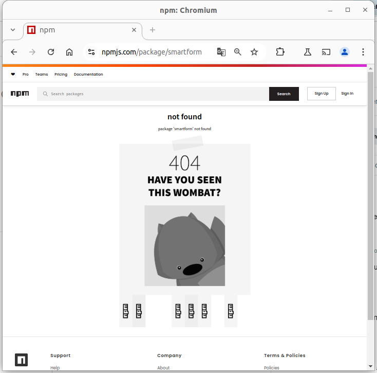
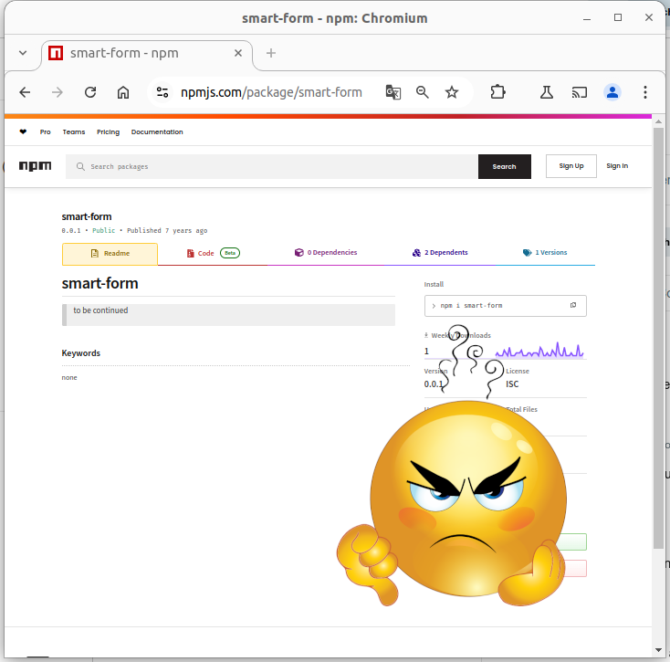
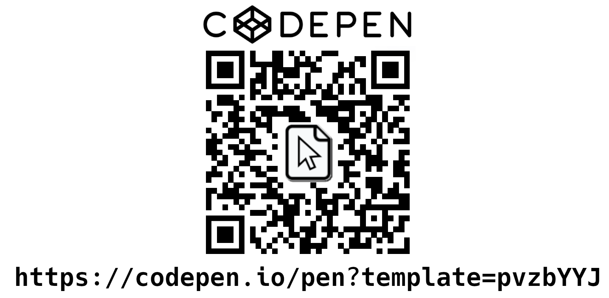

















<meta charset="utf-8" />
<meta name="viewport" content="width=1024" />
<meta name="apple-mobile-web-app-capable" content="yes" />

<link href="//fonts.googleapis.com/css?family=Open+Sans:regular,semibold,italic,italicsemibold|PT+Sans:400,700,400italic,700italic|PT+Serif:400,700,400italic,700italic" rel="stylesheet" />

<link href="css/impress-demo.css" rel="stylesheet" />
<link href="css/impress-common.css" rel="stylesheet" />




    

        

        <!-- Just a blank slide to avoid initial rendering problem in Firefox -->
    


    

        <h1 class="big-text center">“Atention Is All You Need”</h1>
        

            <ul>
                <li>Efectivamente, falta una "t". Y ahora que prestáis atención, ya tengo lo que necesito para empezar...</li>
                <li>Esa frase es el título de un famoso Paper que, para el que no lo sepa, dió orígen a la actual revolución de IA.</li>
            </ul>
        

    


    

        

        
        

        

            
            
            
            
        

        

            <ul>
                <li>...Pero hoy no vamos a hablar de IA.</li>
                <li>Hoy vamos a desinfoxificarnos (o "desiaficarnos") de tanta IA.</li>
                <li>Hoy hablaremos de Formularios Web.</li>
            </ul>
        

    


    

        <h1 class="center medium-text">Czy jest na sali jakiś Polak?</h1>
        

            <ul>
                <li>Traducción: «Algún polonés en la sala?»</li>
                <li>Pequeña broma para comentar que recientemente descubrí que "Smark" significa "moco" en Polaco.</li>
            </ul>
        

    


    

        <h1 class="center medium-text">Smark = Smart + Markup</h1>
        

            
            
        

    


    

        <h1 class="big-text center">🥱</h1> 
        
&nbsp;

        <h1 class="center medium-text">Otra libreria de formularios...</h1>
        <h1 class="big-text center">&nbsp;</h1> 
    


    

        <h1 class="big-text center">🤔</h1> 
        <h1 class="center medium-text" style="color: blue;">¿Por qué SmarkForm es distinta?</h1>
        <ul style="float: left">
            <li class="substep">👌 Sencillez</li>
            <li class="substep">⚡ Potencia</li>
            <li class="substep">🫶 Usabilidad</li>
        </ul>
        <ul style="float: right">
            <li class="substep">♿ Accesibilidad</li>
            <li class="substep">🏗️ Extendibilidad</li>
            <li class="substep">🚁 Independencia</li>
        </ul>
    


    

        <h1 class="medium-text">👌 Sencillez</h1>
        <ul>
            <li class="substep">👉 HTML + metadatos</li>
            <li class="substep">👉 Markup-agnostic (Atributo <i class="shadow">data-smark</i>)</li>
            <li class="substep">👉 SoC (MVC)</li>
            <li class="substep">👉 <b>Zero-Wiring</b></li>
            <li>&nbsp;</li>
        </ul>
    


    

        <h1 class="medium-text">👉 Zero-Wiring</h1>
        <ul>
            <li class="substep">🔧 Acciones (por tipo de campo)</li>
            <li class="substep l2 small-text">🪛 <i>import, export, clear</i>...</li>
            <li class="substep">🔧 Disparadores (Triggers)</li>
            <li class="substep l2 small-text">🪛 Trigger →  Acción</li>
            <li class="substep">🔧 Contexto (Natural / Explícito)</li>
            <li class="substep l2 small-text">🪛 (Direccionabilidad) </li>
            <li class="substep l2 small-text">🪛 "ruta/relativa", "../superior", "/ruta/absoluta"... </li>
            <li class="substep">🔧 Objetivo o "target"</li>
            <li class="substep l2 small-text">🪛 (Implicito / Ruta o "*")</li>
        </ul>
    


    

        <h1 class="medium-text">👌 Sencillez 👀</h1>
        {{ rendered_simplicity_example }}
    


    

        <h1 class="big-text center">🛠️ DIY</h1>
        <h1 class="center substep">1. Crea tu primer formulario</h1>
        
&nbsp;

        <ul>
            <li class="substep">🤔 Elige un proyecto</li>
            <li class="substep">👉 Elige un Stack</li>
            <li class="l2 substep">➡️  ESM / UMD.</li>
            <li class="l2 substep">➡️  NPM / GitHub / Descarga...</li>
            <li class="l2 substep">➡️  Fichero local / Servidor HTTP / CodePen...</li>
            <li class="l2 substep">➡️  Ejemplo / Boilerplate / Desde cero.</li>
            <li class="substep">🚀 Empieza!!</li>
        </ul>
    


    

        

            
        

    


    

        <h1 class="center medium-text">⚡ Potencia</h1>
        <ul>
            <li class="substep">👉 JSON ⬆️ / ⬇️ </li>
            <li class="substep">👉 Subformularios</li>
            <li class="substep">👉 Listas dinámicas ordenables</li>
            <li class="substep gray">👉 Gestión de interdependéncia</li>
            <li class="l2 substep gray">➡️  The API Interface</li>
            <li class="substep">👉 Tipado y validación</li>
        </ul>
    


    

        <h1 class="center">⚡ Potencia 👀</h1>
        {{ rendered_power_example }}
    


    

        <h1 class="big-text center">🛠️ DIY</h1>
        <h1 class="center substep">2. Completa tu formulario</h1>
        
&nbsp;

        <ul>
            <li class="substep small-text">👉 Utiliza listas y subformularios si los necesitas.</li>
            <li class="substep small-text">👉 Dispón los controles (triggers) donde se precisen.</li>
            <li class="substep small-text">👉 Ajusta los parámetros a la funcionalidad deseada.</li>
            <li class="substep small-text">👉 Gestiona los eventos.</li>
            <li class="substep small-text">👍 Verifica que todo funcione corréctamente.</li>
        </ul>
    


    

        <h1 class="center medium-text">🫶 Usabilidad </h1>
        <ul>
            <li class="substep">👉 Navegación natural </li>
            <li class="substep">👉 Hot-keys contextuales</li>
            <li class="substep">👉 Plegado de secciones</li>
            <li class="substep">👉 (Auto)ordenación...</li>
            <li class="l2 substep">🔗 https://github.com/drag-drop-touch-js/dragdroptouch</li>
        </ul>
    


    

        <h1 class="medium-text center">🫶 Usabilidad  👀</h1>
        {{ rendered_usability_example }}
    


    

        <h1 class="big-text center">🛠️ DIY</h1>
        <h1 class="center substep">3. Mejora la Usabilidad</h1>
        
&nbsp;

        <ul>
            <li class="substep small-text">👉 Ajusta las teclas rápidas.</li>
            <li class="substep small-text">👉 Permite la ordenación (si procede).</li>
            <li class="substep small-text">👉 Comprueba la navegación con el teclado.</li>
            <li class="substep small-text">👉 Revisa los estilos (CSS).</li>
            <li class="substep small-text">👉 Verifica el funcionamiento en distiontos dispositivos.</li>
        </ul>
    


    

        <h1 class="center medium-text">♿ Accesibilidad</h1>
        <ul>
            <li class="substep">👉 Máxima libertad en la maquetación.</li>
            <li class="substep">👉 Mínima intrusión en el foco.</li>
            <li class="substep gray">🚧 Todavía queda trabajo por hacer...</li>
            <li class="substep">🆘 Help!!</li>
        </ul>
    


    

        <h1 class="center medium-text">🏗️ Extendibilidad</h1>
        <ul>
            <li class="substep">👉 Crea tus propios tipos:</li>
            <li class="l2 substep">➡️  <code class="small-text">class myType extends Smarkform.types.input { ... }</code></li>
            <li class="l2 substep">➡️  <code class="small-text">SmarkForm.createType(name, myType);</code></li>
            <li class="substep gray">💡 SmarkForm mixins:</li>
            <li class="l2 substep gray">➡️  <code class="small-text">SmarkFrom.createMixin(name, htmlsource);</code></li>
            <li class="l2 substep gray">🩹 (Mixins de plantillas PUG o similar...)</li>
        </ul>
    


    

        <h1 class="center medium-text">🚁 Independencia</h1>
        <ul>
            <li class="substep">👉 Vanilla JS.</li>
            <li class="substep">👉 ES module / UMD</li>
            <li class="substep">👉 CDN / NPM / GitHub</li>
        </ul>
    


    

        <h1 class="center medium-text gray">🔮 Futuro</h1>
        <ul>
            <li class="substep gray">👉 &lt;select&gt;</li>
            <li class="substep gray l2">➡️  "Interdependéncia"</li>
            <li class="substep gray l2">➡️  Carga dinámica</li>
            <li class="substep gray">👉 The "API" interface</li>
            <li class="substep gray l2">➡️  &lt;option data-src='["https:...", {...}, "POST"]'&gt;</li>
            <li class="substep gray l2">➡️  Adaptadores personalizados.</li>
        </ul>
    


    

        

            <h1 class="big-text">➕ ❓</h1>
        

    


    

        

            

                <a
                    style="color: darkblue;"
                    href="https://smarkform.bitifet.net"
                    target=_blank
                >👉 https://smarkform.bitifet.net</a>
            

            <iframe class="substep" style="width:1200px;height:650px;margin-left:-200px;" src="https://smarkform.bitifet.net"></iframe>
        

    


    

        

            <h1 class="medium-text" style="color: red;">Cómo puedo ayudar?</h1>
        

        <ul>
            <li class="substep">✊ Usándola</li>
            <li class="substep">📢 Dándola a conocer</li>
            <li class="substep">🪲 Reportando errores</li>
            <li class="substep">💡 Aportando sugerencias, peticiones...</li>
            <li class="substep">🔧 Y, por supuesto, se aceptan PRs!!</li>
        </ul>
    


    

        

            <h1 class="medium-text">Thanks for your a<b style="color:red">tt</b>ention!!</h1>
        

    


    

        

            <h1 class="big-text">Grácias</h1>
            

            
            
            

        

    


    

        

            <h1 class="big-text">Preguntas... ??</h1>
        

    

    

        https://smarkform.bitifet.net
    

    

        https://techspirit.org
    

<!--
    This is a UI plugin. You can read more about plugins in src/plugins/README.md.
    For now, I'll just tell you that this adds some graphical controls to navigate the
    presentation. In the CSS file you can style them as you want. We've put them bottom right.
-->

<!--
    
    Hint is not related to impress.js in any way.
    
    But it can show you how to use impress.js features in creative way.
    
    When the presentation step is shown (selected) its element gets the class of "active" and the body element
    gets the class based on active step id `impress-on-ID` (where ID is the step's id)... It may not be
    so clear because of all these "ids" in previous sentence, so for example when the first step (the one with
    the id of `bored`) is active, body element gets a class of `impress-on-bored`.
    
    This class is used by this hint below. Check CSS file to see how it's shown with delayed CSS animation when
    the first step of presentation is visible for a couple of seconds.
    
    ...
    
    And when it comes to this piece of JavaScript below ... kids, don't do this at home ;)
    It's just a quick and dirty workaround to get different hint text for touch devices.
    In a real world it should be at least placed in separate JS file ... and the touch content should be
    probably just hidden somewhere in HTML - not hard-coded in the script.
    
    Just sayin' ;)
    
-->

    
Use a spacebar or arrow keys to navigate.  
       Press 'P' to launch speaker console.

<!--
    
    The `impress()` function also gives you access to the API that controls the presentation.
    
    Just store the result of the call:
    
        var api = impress();
    
    and you will get three functions you can call:
    
        `api.init()` - initializes the presentation,
        `api.next()` - moves to next step of the presentation,
        `api.prev()` - moves to previous step of the presentation,
        `api.goto( stepIndex | stepElementId | stepElement, [duration] )` - moves the presentation to the step given by its index number
                id or the DOM element; second parameter can be used to define duration of the transition in ms,
                but it's optional - if not provided default transition duration for the presentation will be used.
    
    You can also simply call `impress()` again to get the API, so `impress().next()` is also allowed.
    Don't worry, it won't initialize the presentation again.
    
    For some example uses of this API check the last part of the source of impress.js where the API
    is used in event handlers.
    
-->

