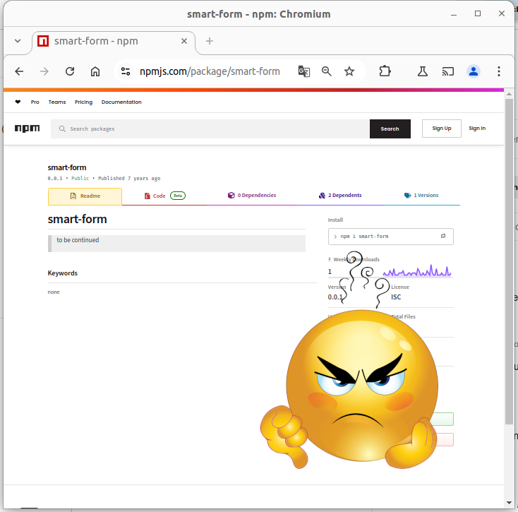













<meta charset="utf-8" />
<meta name="viewport" content="width=1024" />
<meta name="apple-mobile-web-app-capable" content="yes" />

<link href="//fonts.googleapis.com/css?family=Open+Sans:regular,semibold,italic,italicsemibold|PT+Sans:400,700,400italic,700italic|PT+Serif:400,700,400italic,700italic" rel="stylesheet" />

<link href="css/impress-demo.css" rel="stylesheet" />
<link href="css/impress-common.css" rel="stylesheet" />




    

        <h1 class="big-text center">“Atention Is All You Need”</h1>
        

            <ul>
                <li>Efectivamente, falta una "t". Y ahora que prestáis atención, ya tengo lo que necesito para empezar...</li>
                <li>Esa frase es el título de un famoso Paper que, para el que no lo sepa, dió orígen a la actual revolución de IA.</li>
            </ul>
        

    


    

        

        
        

        

            
            
            
            
        

        

            <ul>
                <li>...Pero hoy no vamos a hablar de IA.</li>
                <li>Hoy vamos a desinfoxificarnos (o "desiaficarnos") de tanta IA.</li>
                <li>Hoy hablaremos de Formularios Web.</li>
            </ul>
        

    


    

        <h1 class="center medium-text">Czy jest na sali jakiś Polak?</h1>
        

            <ul>
                <li>Traducción: «Algún polonés en la sala?»</li>
                <li>Pequeña broma para comentar que recientemente descubrí que "Smark" significa "moco" en Polaco.</li>
            </ul>
        

    


    

        <h1 class="center medium-text">Smark = Smart + Markup</h1>
        

            
            
        

    


    

        <h1 class="big-text center">🥱</h1> 
        
&nbsp;

        <h1 class="center medium-text">Otra libreria de formularios...</h1>
        <h1 class="big-text center">&nbsp;</h1> 
    


    

        <h1 class="big-text center">🤔</h1> 
        
&nbsp;

        <h1 class="center medium-text" style="color: blue;">¿Por qué SmarkForm es distinta?</h1>
        <h1 class="big-text center">&nbsp;</h1> 
    


    

        <h1 class="medium-text">👌 Sencillez</h1>
        <ul>
            <li class="substep">👉 HTML + metadatos</li>
            <li class="substep">👉 Markup-agnostic</li>
            <li class="substep">👉 SoC (MVC)</li>
            <li class="substep">👉 <b>Zero-Wiring:</b></li>
            <li class="substep l2">🔧 Acciones.</li>
            <li class="substep l2">🔧 Triggers contextuales.</li>
            <li class="substep l2">🔧 Rutas "directory-like".</li>
        </ul>
    


    

        <h1>👌 Sencillez 👀</h1>
        {{ rendered_simplicity_example }}
    


    

        <h1 class="medium-text">🚀 Poténcia</h1>
        <ul>
            <li class="substep">👉 JSON ⬆️ / ⬇️ </li>
            <li class="substep">👉 Subformularios</li>
            <li class="substep">👉 Listas dinámicas ordenables</li>
            <li class="substep gray">👉 Gestión de interdependéncia</li>
            <li class="substep">👉 Tipado y validación</li>
        </ul>
    


    

        <h1>🚀 Poténcia 👀</h1>
        {{ rendered_power_example }}
    


    

        <h1 class="medium-text">🫶 Usabilidad </h1>
        <ul>
            <li class="substep">👉 Navegación natural </li>
            <li class="substep">👉 Hot-keys contextuales</li>
            <li class="substep">👉 Plegado de secciones</li>
            <li class="substep">👉 (Auto)ordenación...</li>
        </ul>
    


    

        <h1 class="medium-text">♿ Accesibilidad</h1>
        <ul>
            <li class="substep">👉 Tiene en cuenta aspectos de accesibilidad. </li>
            <li class="substep gray">👉 Todavía queda trabajo por hacer...</li>
            <li class="substep">🆘 Help!!</li>
        </ul>
    


    

        <h1 class="medium-text">🏗️ Extendibilidad</h1>
        <ul>
            <li class="substep">👉 Posibilidad de incorporar nuevos tipos de campos.</li>
            <li class="substep gray">👉 Incluso fragmentos o "Mixin"s.</li>
        </ul>
    


    

        <h1 class="medium-text">🚁 Independéncia</h1>
        <ul>
            <li class="substep">👉 Vanilla JS.</li>
            <li class="substep">👉 ES module / UMD</li>
            <li class="substep">👉 CDN / NPM / GitHub</li>
        </ul>
    


    

        

            <h1 class="medium-text">— Principios —</h1>
             
            <ul>
                <li class="substep big-text">DRY</li>
                <li class="substep big-text">SoC</li>
                <li class="substep big-text">KISS</li>
            </ul>
             
        

        

            <ul>
                <li>👉 Cita: «Sin frameworks modernos no se pueden hacer aplicaciones complejas»</li>
                <li>👉 Las complicaciones ya vienen sólas.</li>
            </ul>
        

    


    

        

            <h1 class="big-text">➕ ❓</h1>
        

    


    

        

            

                <a
                    style="color: darkblue;"
                    href="https://smarkform.bitifet.net"
                    target=_blank
                >👉 https://smarkform.bitifet.net</a>
            

            <iframe class="substep" style="width:1200px;height:650px;margin-left:-200px;" src="https://smarkform.bitifet.net"></iframe>
        

    


    

        

            <h1 class="medium-text" style="color: red;">Como puedo ayudar?</h1>
        

        <ul>
            <li class="substep">✊ Usándola</li>
            <li class="substep">📢 Dándola a conocer</li>
            <li class="substep">🪲 Reportando errores</li>
            <li class="substep">💡 Aportando sugerencias, peticiones...</li>
            <li class="substep">🔧 Y, por supuesto, se aceptan PRs!!</li>
        </ul>
    


    

        

            <h1 class="medium-text">Thanks for your a<b style="color:red">tt</b>ention!!</h1>
            
Preguntas... ??

        

    

<!--
    This is a UI plugin. You can read more about plugins in src/plugins/README.md.
    For now, I'll just tell you that this adds some graphical controls to navigate the
    presentation. In the CSS file you can style them as you want. We've put them bottom right.
-->

<!--
    
    Hint is not related to impress.js in any way.
    
    But it can show you how to use impress.js features in creative way.
    
    When the presentation step is shown (selected) its element gets the class of "active" and the body element
    gets the class based on active step id `impress-on-ID` (where ID is the step's id)... It may not be
    so clear because of all these "ids" in previous sentence, so for example when the first step (the one with
    the id of `bored`) is active, body element gets a class of `impress-on-bored`.
    
    This class is used by this hint below. Check CSS file to see how it's shown with delayed CSS animation when
    the first step of presentation is visible for a couple of seconds.
    
    ...
    
    And when it comes to this piece of JavaScript below ... kids, don't do this at home ;)
    It's just a quick and dirty workaround to get different hint text for touch devices.
    In a real world it should be at least placed in separate JS file ... and the touch content should be
    probably just hidden somewhere in HTML - not hard-coded in the script.
    
    Just sayin' ;)
    
-->

    
Use a spacebar or arrow keys to navigate.  
       Press 'P' to launch speaker console.

<!--
    
    Last, but not least.
    
    To make all described above really work, you need to include impress.js in the page.
    I strongly encourage to minify it first.
    
    In here I just include full source of the script to make it more readable.
    
    You also need to call a `impress().init()` function to initialize impress.js presentation.
    And you should do it in the end of your document. Not only because it's a good practice, but also
    because it should be done when the whole document is ready.
    Of course you can wrap it in any kind of "DOM ready" event, but I was too lazy to do so ;)
    
-->

<!--
    
    The `impress()` function also gives you access to the API that controls the presentation.
    
    Just store the result of the call:
    
        var api = impress();
    
    and you will get three functions you can call:
    
        `api.init()` - initializes the presentation,
        `api.next()` - moves to next step of the presentation,
        `api.prev()` - moves to previous step of the presentation,
        `api.goto( stepIndex | stepElementId | stepElement, [duration] )` - moves the presentation to the step given by its index number
                id or the DOM element; second parameter can be used to define duration of the transition in ms,
                but it's optional - if not provided default transition duration for the presentation will be used.
    
    You can also simply call `impress()` again to get the API, so `impress().next()` is also allowed.
    Don't worry, it won't initialize the presentation again.
    
    For some example uses of this API check the last part of the source of impress.js where the API
    is used in event handlers.
    
-->

<!--
    
    Now you know more or less everything you need to build your first impress.js presentation, but before
    you start...
    
    Oh, you've already cloned the code from GitHub?
    
    You have it open in text editor?
    
    Stop right there!
    
    That's not how you create awesome presentations. This is only a code. Implementation of the idea that
    first needs to grow in your mind.
    
    So if you want to build great presentation take a pencil and piece of paper. And turn off the computer.
    
    Sketch, draw and write. Brainstorm your ideas on a paper. Try to build a mind-map of what you'd like
    to present. It will get you closer and closer to the layout you'll build later with impress.js.
    
    Get back to the code only when you have your presentation ready on a paper. It doesn't make sense to do
    it earlier, because you'll only waste your time fighting with positioning of useless points.
    
    If you think I'm crazy, please put your hands on a book called "Presentation Zen". It's all about 
    creating awesome and engaging presentations.
    
    Think about it. 'Cause impress.js may not help you, if you have nothing interesting to say.
    
-->

<!--
    
    Are you still reading this?
    
    For real? I'm impressed! 
    
    But now, take my advice and take some time off. Make yourself a cup of coffee, tea,
    or anything you like to drink.
    
    Cheers!
    
-->
